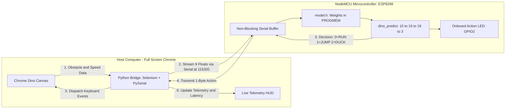

# Chrome Dino Edge AI on NodeMCU (ESP8266)

<div align="center">


<p align="center">
  <b>An end-to-end Edge AI project that runs a PyTorch-trained Neural Network directly on an ESP8266 microcontroller chip to play the Chrome Dinosaur Game in real time over USB Serial at 60-80 FPS.</b>
</p>

</div>

---

## Highlights

* **100% On-Chip Neural Network**: The model lives and executes inside the NodeMCU Flash ROM (`PROGMEM`). No hardcoded heuristics or distance threshold rules.
* **Ultra-Low Latency (< 0.1 ms)**: Optimized C forward pass with fixed memory allocation and non-blocking serial packet buffering.
* **High Score: 4,567**: Successfully navigates 100+ obstacle sequences and flying pterodactyls at maximum speed cap (`13.0 px/frame`).
* **Full-Screen Live Telemetry HUD**: Glassmorphic dashboard displaying live decisions, distance, physics, and round-trip serial latency in real time.
* **Draggable Interface**: Drag the on-screen dashboard anywhere to avoid obstructing the in-game score.
* **Complete Student Study Course**: 4 in-depth modular guides covering feature engineering, PyTorch math, embedded C optimization, and real-world industrial IoT applications in [`study_material/`](study_material/README.md).

---

## Complete Study Material & Engineering Course

Comprehensive step-by-step notes, mathematical derivations, code walkthroughs, and real-world industrial applications are provided in the [`study_material/`](study_material/README.md) directory:

1. [Module 01: Data & Feature Engineering](study_material/01_data_and_feature_engineering.md) - Game state extraction, why features beat raw pixels, Time-To-Collision physics, data cleaning pipeline, and robotics parallels.
2. [Module 02: Neural Network Math & PyTorch Training](study_material/02_neural_network_math_and_pytorch.md) - MLP architecture, forward pass math, ReLU benefits, inverse class frequency weighting, input scaling, and C code generation.
3. [Module 03: Embedded C & Hardware Inference](study_material/03_embedded_c_and_hardware_inference.md) - ESP8266 memory architecture, Flash ROM (`PROGMEM`) vs SRAM, pure C forward pass (`< 0.08 ms`), and non-blocking serial packet parsing.
4. [Module 04: Real-Time Bridge & Real-World Applications](study_material/04_realtime_bridge_and_realworld_applications.md) - Sub-2ms latency budgeting, Selenium bridge, stateful keypress controller, and complete blueprints for factory predictive maintenance, precision agriculture, smart wearables, and drone collision avoidance.

---

## System Architecture



---

## Hardware Requirements

| Item | Specification | Notes |
| :--- | :--- | :--- |
| **Microcontroller** | NodeMCU ESP8266 (v2 / v3 / CP2102 / CH340) | Standard ESP-12E module (80MHz CPU) |
| **USB Cable** | Micro-USB Data Cable | Ensure it supports data transfer, not power-only |
| **Computer** | Windows, macOS, or Linux | With Google Chrome and Python 3.10+ |

---

## Detailed NodeMCU Setup and Flashing Guide

Follow this step-by-step guide to flash the trained model onto your NodeMCU.

### Step 1: Install the USB-to-Serial Driver
Connect your NodeMCU to your computer with the USB cable. Most NodeMCU boards use one of two USB communication chips:
* **CP2102 (Silicon Labs)**: [Download CP210x VCP Driver](https://www.silabs.com/developers/usb-to-uart-bridge-vcp-drivers)
* **CH340 / CH341**: [Download CH340 Driver](http://www.wch-ic.com/downloads/CH341SER_EXE.html)

> To verify: Open Windows Device Manager -> **Ports (COM & LPT)**. You should see a device like `Silicon Labs CP210x USB to UART Bridge (COM3)`.

---

### Step 2: Configure Arduino IDE for ESP8266

1. Open **Arduino IDE**.
2. Go to **File** -> **Preferences**.
3. In the field labeled **"Additional Boards Manager URLs"**, paste:
   ```text
   http://arduino.esp8266.com/stable/package_esp8266com_index.json
   ```
4. Click **OK**.
5. Go to **Tools** -> **Board** -> **Boards Manager...**
6. Search for `esp8266` and click **Install** on **"esp8266 by ESP8266 Community"**.

---

### Step 3: Open the Firmware Sketch

1. In Arduino IDE, click **File** -> **Open...**
2. Browse to and open:
   ```text
   firmware/dino_nodemcu/dino_nodemcu.ino
   ```
   *(Notice that [`model.h`](firmware/dino_nodemcu/model.h) is located in the same directory with all trained neural network weights in Flash memory).*

---

### Step 4: Configure Board Settings in Arduino IDE

Under the **Tools** menu, set the following parameters:

* **Board:** `ESP8266 Boards` -> **NodeMCU 1.0 (ESP-12E Module)**
* **CPU Frequency:** `80 MHz` (or `160 MHz` for maximum performance)
* **Upload Speed:** `115200`
* **Flash Size:** `4MB (FS:2MB OTA:~1019KB)`
* **Port:** Select your NodeMCU's COM port (e.g. `COM3`)

---

### Step 5: Upload Firmware to NodeMCU

1. Click the **Upload** button (arrow icon at top-left).
2. The Arduino IDE will compile the neural network and write the binary to Flash ROM:
   ```text
   Writing at 0x00000000... (100 %)
   Wrote 273952 bytes in 18.7 seconds...
   Hash of data verified.
   Leaving...
   Hard resetting via RTS pin...
   ```
3. **Success Indicator**: The onboard blue LED on the NodeMCU will flash **3 times** on startup to signal that the AI inference engine is initialized and ready.

> **CRITICAL**: Make sure to **CLOSE the Arduino Serial Monitor** if open. If the Serial Monitor is open, Python will not be able to connect to the COM port.

---

## How to Run and Play

### 1. Install Dependencies
In your terminal, navigate to the project directory and install the required Python packages:

```bash
pip install -r requirements.txt
```

---

### 2. Launch the AI Game Bridge
Run the root launcher:

```bash
python play.py
```
*(Or directly: `python bridge/play_nodemcu.py`)*

### Automated Workflow:
1. Auto-detects the NodeMCU USB port (e.g. `COM3`).
2. Opens **Google Chrome in Full Screen**.
3. Streams live obstacle distance, speed, and dinosaur physics over Serial at **80 Hz**.
4. NodeMCU makes on-chip decisions and commands the dinosaur to **Jump**, **Duck**, or **Run**.
5. The live glassmorphic HUD appears on the **top-right** of the screen with sub-millisecond telemetry.

---

## Live Telemetry Dashboard (Top-Right HUD)

The bridge injects a HUD on the top-right corner of the Chrome window:

```
+-----------------------------------------------+
|  Dino AI - NodeMCU                   ONLINE   |
+-----------------------------------------------+
| CURRENT ACTION                        RUNNING |
+-----------------------+-----------------------+
| GAME SCORE            | MCU LATENCY           |
| 4567     HI 4567      | 1.8 ms                |
+-----------------------+-----------------------+
| OBSTACLE              | SPEED / TTC           |
| 142px   Small Cactus  | 13.0 spd / 10.9       |
+-----------------------+-----------------------+
| Port: COM3 (115.2k)              drag to move |
+-----------------------------------------------+
```

* **Positioned Safely**: Mounted at `top: 75px` so Chrome Dino's native high score counter (`HI 00000`) remains visible.
* **Draggable**: Click and drag the header bar to move the card anywhere on screen.
* **Action Status Indicators**:
  * `RUNNING` - Emerald
  * `JUMPING` - Amber
  * `DUCKING` - Purple
  * `CRASHED` - Red with Auto-Restart

---

## Neural Network and ML Architecture

```
Input Layer (10 Features)
    |
    v
Dense Layer 1 (16 Neurons + ReLU)
    |
    v
Dense Layer 2 (16 Neurons + ReLU)
    |
    v
Output Layer (3 Classes: NOTHING / JUMP / DUCK)
```

### 1. Input Features
Every frame, the microcontroller receives 9 raw floats and computes the derived Time-To-Collision (`ttc`):

| Index | Feature | Description |
| :--- | :--- | :--- |
| 0 | `dist` | Distance from dinosaur to obstacle (px) |
| 1 | `speed` | Current game scroll speed |
| 2 | `obs_small` | Binary flag for small cactus |
| 3 | `obs_large` | Binary flag for large cactus |
| 4 | `obs_bird` | Binary flag for pterodactyl |
| 5 | `obs_y` | Vertical position of obstacle |
| 6 | `obs_h` | Obstacle height (px) |
| 7 | `obs_w` | Obstacle width (px) |
| 8 | `ducking` | Dinosaur current duck state (0 or 1) |
| 9 | `ttc` | Time-to-collision: `dist / max(speed, 0.1)` |

### 2. Feature Normalization and Scaling
Inputs are scaled and clipped to `[-1.0, 1.0]`:

```text
normalized_input[i] = clip(raw_input[i] / SCALE[i], -1.0, 1.0)
```

Where:
```text
SCALE = [500.0, 13.0, 1.0, 1.0, 1.0, 150.0, 50.0, 75.0, 1.0, 80.0]
```

### 3. Training and Weight Export
* Trained in PyTorch ([`training/train.py`](training/train.py)) with `CrossEntropyLoss` and inverse class frequency weighting.
* Exports directly into:
  * [`models/model.h`](models/model.h) / [`firmware/dino_nodemcu/model.h`](firmware/dino_nodemcu/model.h) - C `PROGMEM` constants for Arduino.
  * [`models/model.json`](models/model.json) - JSON weights for browser inference.

---

## Alternative: Play Directly in Browser (No Hardware)

If you do not have a NodeMCU connected, you can run the neural network directly inside your browser:

1. Open **Google Chrome** -> navigate to `chrome://dino` (or disconnect internet and hit Space).
2. Press **`F12`** -> switch to the **Console** tab.
3. Paste the contents of [`browser/browser_ai.js`](browser/browser_ai.js) and press **Enter**.
4. Click **"Pick model.json"** on the floating overlay and select [`models/model.json`](models/model.json).

---

## Repository Directory Structure

```text
dino-ai-nodemcu/
├── firmware/                        # Microcontroller source code
│   └── dino_nodemcu/
│       ├── dino_nodemcu.ino         # Ultra-fast non-blocking Arduino sketch
│       └── model.h                  # Neural network weights in C PROGMEM
│
├── bridge/                          # PC-to-Hardware Bridge
│   └── play_nodemcu.py              # Full-screen launcher, serial bridge, and right HUD
│
├── training/                        # Machine Learning Pipeline
│   ├── prepare_data.py              # Raw recording cleaner -> CSV dataset
│   └── train.py                     # PyTorch MLP training and C header exporter
│
├── browser/                         # In-Browser AI (No hardware required)
│   ├── browser_ai.js                # JS neural network runner with model picker UI
│   └── webserial_bridge.js          # Direct Web Serial connector
│
├── models/                          # Exported Neural Network Weights
│   ├── model.h                      # C PROGMEM weights for microcontrollers
│   └── model.json                   # JSON weights for browser inference
│
├── data/                            # Datasets
│   └── dino_clean.csv               # 25,000+ cleaned training frames
│
├── play.py                          # 1-click root launcher (python play.py)
├── requirements.txt                 # Python dependencies
├── .gitignore                       # Git ignore rules
├── DEVELOPMENT_REPORT.md            # Detailed engineering log, audit, and fixes
└── README.md                        # Project documentation
```

---

## Troubleshooting and FAQs

#### Q: Python says `Could not open port COM3: PermissionError`
* **Fix**: The **Serial Monitor is open in Arduino IDE**. Close the Serial Monitor window and re-run `python play.py`.

#### Q: No serial devices found / COM port does not appear
* **Fix**: 
  1. Ensure your Micro-USB cable is a **data cable** (some cables are power-only).
  2. Install the **CP2102** or **CH340** driver mentioned in Step 1.

#### Q: Why did the Dino crash at score 4567?
* **Explanation**: At score 4000+, the game runs at maximum velocity (`speed = 13.0`). If two obstacles spawn in close cluster sequence (~50px apart), the dinosaur is still in the air descending from jump 1 when obstacle 2 arrives, leaving insufficient ground runway for takeoff.

---

## License

This project is licensed under the **MIT License**.
